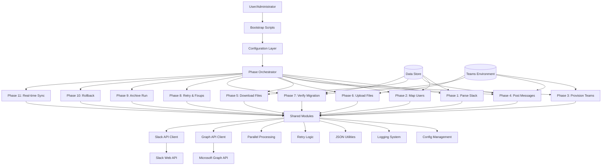
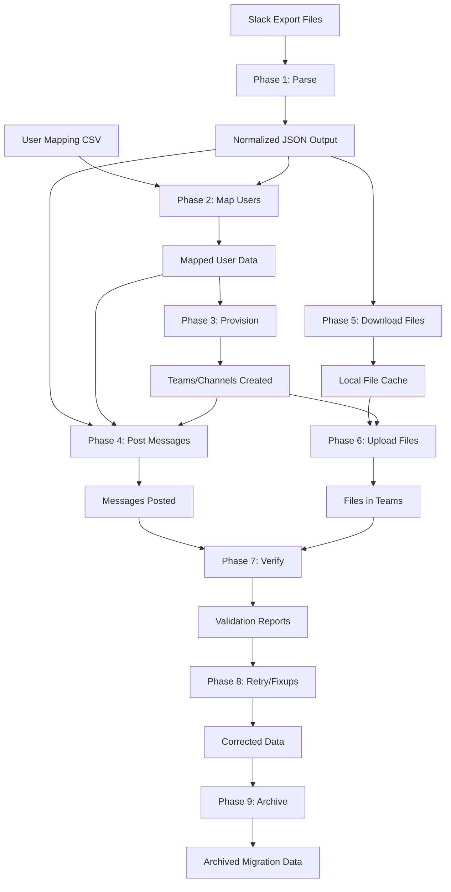

# Slack to Teams Migration Tool - System Architecture

## 1. System Overview and Context

The Slack to Teams Migration Tool is a comprehensive PowerShell-based automation solution designed to migrate Slack workspace data to Microsoft Teams. The system processes Slack export files and utilizes Microsoft Graph API to recreate channels, messages, users, and file attachments in Teams, ensuring data integrity and continuity during platform transitions.

### Business Context
Organizations migrating from Slack to Teams require reliable, automated data transfer to maintain historical conversations, file attachments, and user mappings. This tool addresses the gap left by manual processes and third-party services by providing a secure, customizable PowerShell solution.

### System Scope
- **In Scope**: Channel migration, message posting, user mapping, file transfers, configuration management
- **Out of Scope**: Real-time synchronization (planned for future), GUI interface, multi-platform support

## 2. Architecture Principles and Constraints

### Core Principles
- **Modularity**: Each migration phase is a standalone PowerShell script for flexibility and testability
- **Resilience**: Comprehensive error handling, retry mechanisms, and rollback capabilities
- **Security**: Secure credential management, HTTPS-only communications, no persistent secrets
- **Observability**: Structured logging, progress tracking, and detailed reporting
- **Configurability**: JSON-based configuration with environment variable overrides

### Technical Constraints
- **Platform**: Windows PowerShell 5.1+ or PowerShell Core 7+
- **Dependencies**: Microsoft Graph API, optional Slack Web API
- **Execution Model**: Sequential phase execution with optional parallel processing
- **Data Volume**: Designed for workspaces up to 10k+ messages, 1GB+ file transfers

## 3. Component Architecture

### Component Descriptions

#### Bootstrap Layer
- **Bootstrap-NewMigration.ps1**: Initializes new migration project structure
- **Bootstrap-RunAll.ps1**: Orchestrates complete migration execution
- **Bootstrap-Config.ps1**: Manages configuration scaffolding

#### Phase Layer (11 Phases)
1. **ParseSlack**: Processes Slack export JSON, normalizes data structures
2. **MapUsers**: Resolves Slack user IDs to Microsoft 365 identities via CSV mappings
3. **ProvisionTeams**: Creates Teams and channels using Microsoft Graph API
4. **PostMessages**: Migrates messages with proper formatting and threading
5. **DownloadFiles**: Retrieves file attachments from Slack export or API
6. **UploadFiles**: Uploads files to Teams and links to messages
7. **VerifyMigration**: Validates migration success, generates reports
8. **RetryAndFixups**: Handles failed operations and manual corrections
9. **ArchiveRun**: Archives logs, outputs, and reports
10. **Rollback**: Reverts Teams changes in case of migration failure
11. **RealTimeSync**: Maintains ongoing synchronization (future enhancement)

#### Shared Modules
- **Shared-Config.ps1**: Configuration loading and management
- **Shared-Logging.ps1**: Structured logging with file and console output
- **Shared-Json.ps1**: JSON file operations and utilities
- **Shared-Retry.ps1**: Exponential backoff retry logic
- **Shared-Parallel.ps1**: Parallel processing utilities
- **Shared-Graph.ps1**: Microsoft Graph API client
- **Shared-Slack.ps1**: Slack API client and export parsing

## 4. Data Architecture and Flow

### Data Flow Diagram

### Data Structures

#### Slack Export Format
- **users.json**: User metadata (ID, name, email, profile)
- **channels.json**: Channel definitions (ID, name, type, members)
- **Channel directories**: Date-stamped JSON files containing message arrays
- **File attachments**: Referenced by URL or included in export

#### Internal Data Models
- **ParsedMessage**: Normalized message with user mapping, timestamp, content
- **MigrationInventory**: Complete workspace inventory with relationships
- **PhaseOutput**: Structured JSON outputs from each phase
- **ValidationReport**: Success/failure metrics and error details

#### Configuration Data
- **appsettings.json**: Main configuration with API credentials
- **.env**: Environment variable overrides for secrets
- **mappings/users.csv**: Slack-to-Teams user mapping
- **mappings/channels.csv**: Channel name transformations
- **message-filters.json**: Content filtering rules

## 5. API Integration Patterns

### Microsoft Graph API Integration
- **Authentication**: Client credentials flow with token caching
- **Rate Limiting**: Exponential backoff with configurable delays
- **Error Handling**: HTTP status code analysis and retry logic
- **Endpoints Used**:
  - Teams creation and management
  - Channel provisioning
  - Message posting with HTML content
  - File upload to SharePoint/OneDrive
  - User lookup and member management

### Slack API Integration
- **Authentication**: Bearer token authentication
- **Usage**: Primarily for file downloads when export URLs are insufficient
- **Fallback**: Graceful degradation to offline mode
- **Endpoints Used**:
  - files.info for metadata
  - Direct file download URLs

### Integration Patterns
- **Retry Logic**: Configurable attempts with exponential backoff
- **Circuit Breaker**: Not implemented (future enhancement)
- **Idempotency**: Phase-based execution prevents duplicate operations
- **Monitoring**: All API calls logged with timing and success metrics

## 6. Deployment and Operational Architecture

### Deployment Model
- **Packaging**: Directory-based deployment, no installation required
- **Prerequisites**: PowerShell 5.1+, network access to APIs
- **Configuration**: Copy sample configs, customize for environment
- **Execution**: Run bootstrap scripts or individual phases

### Operational Modes
- **Offline Mode**: Uses only Slack export files
- **Live Mode**: Leverages both export and APIs for enhanced fidelity
- **Dry Run**: Validation mode without actual Teams modifications
- **Delta Mode**: Incremental updates for partial migrations

### Monitoring and Observability
- **Logging**: Structured logs with timestamps, levels, and context
- **Progress Tracking**: Phase completion status and metrics
- **Error Reporting**: Detailed error messages with remediation guidance
- **Performance Metrics**: Execution time, API call counts, success rates

### Backup and Recovery
- **Rollback Phase**: Automated reversal of Teams changes
- **Archive Phase**: Complete migration artifacts preservation
- **Retry Phase**: Automated recovery from transient failures

## 7. Security and Compliance Considerations

### Authentication and Authorization
- **Credential Management**: Secure storage via environment variables
- **Token Handling**: In-memory caching with automatic refresh
- **Permissions**: Least-privilege Graph API application permissions
- **Network Security**: HTTPS-only communications

### Data Protection
- **Encryption**: API communications encrypted in transit
- **Access Control**: Teams permissions mirror Slack channel privacy
- **Audit Trail**: Comprehensive logging of all operations
- **Compliance**: GDPR/CCPA considerations for user data handling

### Security Controls
- **Input Validation**: JSON schema validation for configurations
- **Error Handling**: No sensitive data in error messages
- **Code Security**: PowerShell strict mode, no dynamic code execution

## 8. Performance and Scalability Design

### Performance Characteristics
- **Throughput**: 1000+ messages/minute typical
- **Concurrency**: Parallel file processing and API batching
- **Memory Usage**: Streaming processing for large datasets
- **Rate Limiting**: Built-in delays to respect API limits

### Scalability Considerations
- **Data Volume**: Handles workspaces with 10k+ messages
- **File Sizes**: Supports large attachments via chunked upload
- **Execution Time**: Modular phases allow resumable operations
- **Resource Usage**: Minimal system requirements

### Performance Optimizations
- **Batching**: API requests batched where possible
- **Caching**: User lookups and token caching
- **Filtering**: Configurable content filtering to reduce processing
- **Parallel Processing**: Concurrent file operations

## 9. Technology Stack Details

### Core Technologies
- **Language**: PowerShell 5.1+/7+
- **APIs**: Microsoft Graph API v1.0, Slack Web API
- **Data Format**: JSON for configuration and intermediate data
- **File System**: Local directory structure for data persistence

### Dependencies
- **Built-in**: PowerShell standard library
- **External**: Microsoft Graph PowerShell SDK (optional)
- **Network**: Invoke-WebRequest/Invoke-RestMethod for HTTP

### Development Tools
- **Version Control**: Git (repository structure supports it)
- **Testing**: PowerShell test framework integration
- **Documentation**: Markdown-based docs and inline comments

## 10. Decision Records

### ADR 001: PowerShell as Implementation Language
**Context**: Need for cross-platform scripting with strong Windows integration
**Decision**: Use PowerShell for its .NET integration and administrative capabilities
**Consequences**: 
- Excellent Windows/Teams integration
- Learning curve for non-Windows administrators
- Rich ecosystem of modules and cmdlets

### ADR 002: Phase-Based Architecture
**Context**: Complex migration process requiring resumability and error recovery
**Decision**: Modular phase structure with independent execution
**Consequences**:
- High flexibility for partial migrations
- Complex orchestration logic
- Clear separation of concerns

### ADR 003: JSON Configuration with Environment Overrides
**Context**: Need for secure credential management and environment-specific settings
**Decision**: JSON base config with .env file overrides
**Consequences**:
- Secure secret handling
- Easy deployment across environments
- Configuration complexity for users

### ADR 004: Microsoft Graph API for Teams Operations
**Context**: Official API for Teams automation
**Decision**: Direct Graph API usage over third-party tools
**Consequences**:
- Full control over migration process
- API rate limiting challenges
- Dependency on Microsoft service availability

### ADR 005: Offline-First Design
**Context**: Air-gapped environments and API reliability concerns
**Decision**: Slack export parsing as primary data source
**Consequences**:
- Works in disconnected environments
- Limited to exported data fidelity
- Optional API enhancement mode

### ADR 006: Comprehensive Logging and Retry Logic
**Context**: Enterprise requirements for auditability and reliability
**Decision**: Built-in logging, retry mechanisms, and rollback capabilities
**Consequences**:
- High observability and debuggability
- Additional complexity in error handling
- Robust operation in failure scenarios

---

This architecture document serves as the foundation for development and maintenance of the Slack to Teams Migration Tool. It should be updated as the system evolves, with new decision records added for significant architectural changes.